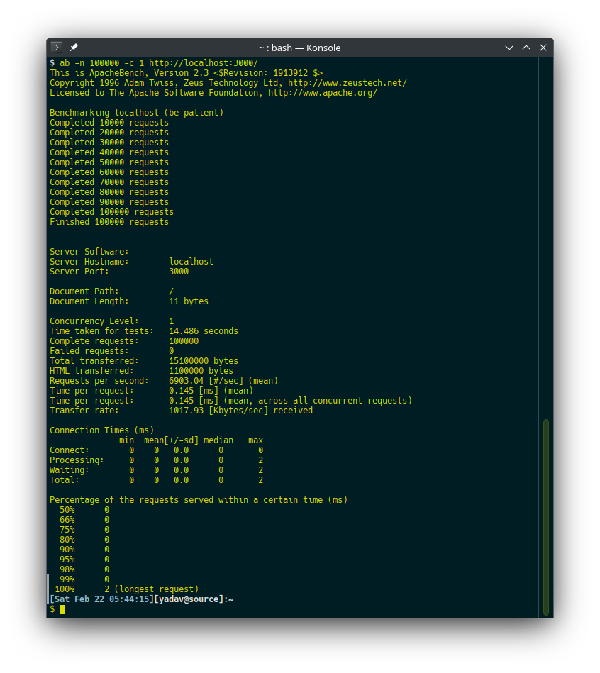

# FURI - Fast Uniform Resource Identifier


## A Return to Simplicity

FURI is a Node.js framework coded in TypeScript. If you love TypeScript, you will feel at home coding with FURI.

### Coding with JavaScript

__File: "main.js"__

```ts
import { Furi } from '@furi-server/furi';
const furi = Furi.create();

furi.get('/', (ctx) => {
    return { message: 'Hello World' };
});

furi.start();
```

### Coding with TypeScript

You can use TypeScript with Node.js, but you will need to compile the TypeScript code to JavaScript before running it with Node.js.

With Deno it is simpler, as it will run the TypeScript code without needing a separate compile step.

__File: "main.ts"__

```ts
import { Furi, ApplicationContext } from '@furi-server/furi';
const furi = Furi.create();

furi.get('/', (ctx: ApplicationContext) => {
    return { message: 'Hello World' };
});

furi.start();
```

### Using NPM and Node.js

To install the NPM package, use:

```sh
npm install @furi-server/furi
```

### Using Deno

If you are using Deno, add the package with:

```sh
deno add npm:@furi-server/furi
```

Under Deno, if you want to configure the default server settings, you can use the "__.env__" file, and pass it the, "__--env-file__" flag.

__File: ".env" (optional)__

```pre
env='development'
port=3100
host='localhost'
```

FURI is currently under development. However it is feature complete with respect to the Router, and today could be put into production use. Current development effort is focused on adding support for a easy to use State management store for seamless data access. Persistence using SQLite3 as the default database engine, with a plug-in architecture for other DB engines.


## Motivation

The primary objective of the FURI project is to provide a fast, small HTTP server that runs on small hardware with low memory. This benefits micro-architect environments with scaling and performance, with faster load time, compact footprint to deal with bigger production loads.

The guiding principle of the project is to have the code base self contain with no external dependencies. This allows for easy deployment and maintenance on any platform that supports Node.js. The aim is for small independent shops to be able to run a production server and website while keeping the cost down substantially, along with the effort to maintain the setup.

## Why

A fast, responsive and lightweight framework that is easy to use. FURI keeps your code simple, avoids useless abstraction and does not get in the way with also working with Node.js core APIs should you ever need to.

Inspired by Express.js and Koa.

## Benchmarks

FURI outperformed both Fastify and Express.js 5.0 in a benchmark test.
Below are the benchmarks results.

1. Number of requests made: 100,000
1. Total time taken in seconds.
1. Requests handled in 1 second.

| Framework | Requests | Total Time | Requests handled / sec  |
| - | - | - | - |
| FURI | 100,000 | 12.670 s | 7892.63 |
| Fastify | 100,000 | 14.486 s | 7124.84 |
| Express.js v5.0 | 100,000 | 13.882 s | 7203.31 |

### FURI Benchmark


### Fastify Benchmark



### Express Benchmark


