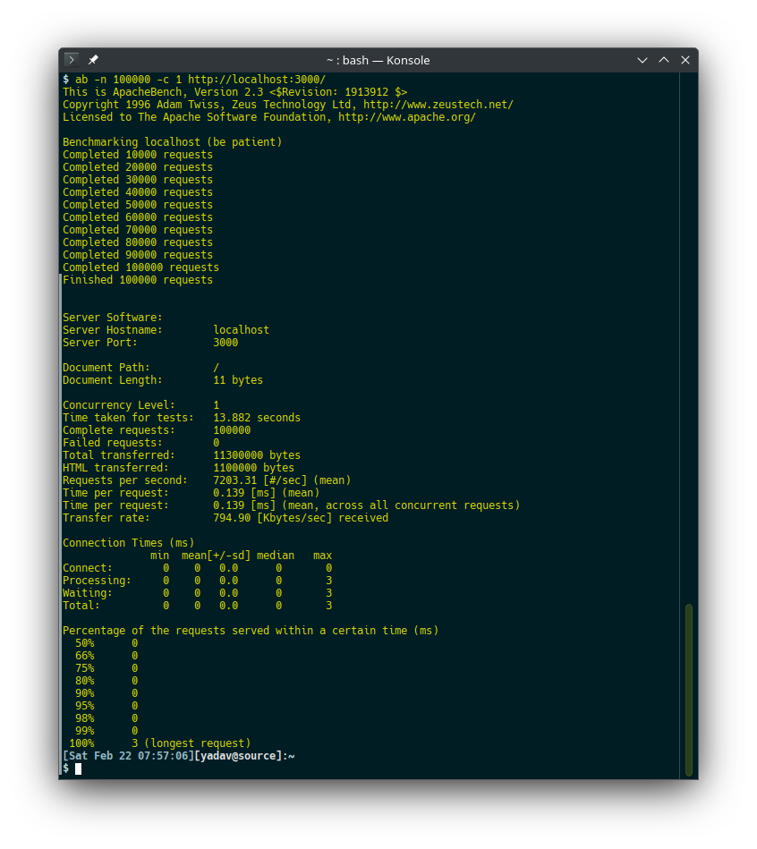

# FURI - Fast Uniform Resource Identifier


## A Return to Simplicity

FURI is Node.js framework coded in TypeScript. If you love TypeScript, you will feel at home coding with FURI.

```ts
import { Furi, ApplicationContext } from 'furi.ts';
const furi = Furi.create();

furi.get('/', (ctx: ApplicationContext) => {
    ctx.end('Hello World');
});

furi.start();
```

FURI is currently under development. However it is feature complete with respect to the Router, and today could be put into production use. Current development effort is focued on the support of a simple State management store for seamless data access. Persistence using SQLite3 as the default DB engine will be the default, with a plug-in architecture for other DB engines.


## Motivation

The aim of the FURI project is to have a fast, small HTTP server that runs on small hardware with low memory. As a result scaling and performance in a mico-arcitecture is a key focus, for bigger production loads.

The aim is for small independent shops to be able to run a production server and website while keeping the cost down substantially, along with the effort to maintain the setup.

## Why

A fast, responsive and lightweight framework that is easy to use. FURI keeps your code simple, avoids useless abstraction and does not get in the way with also working with Node.js core APIs should you ever need to.

Inspired by Express.js and Koa.

## Benchmarks

FURI outperformed both Fastify and Express.js 5.0 in a benchmark test.
Below are the benchmarks results.

1. Number of requests made: 100,000
1. Total time taken in seconds.
1. Requests handled in 1 second.

| Framework | Requests | Total Time | Requests handled / sec  |
| - | - | - | - |
| FURI | 100,000 | 12.670 s | 7892.63 |
| Fastify | 100,000 | 14.486 s | 7124.84 |
| Express.js v5.0 | 100,000 | 13.882 s | 7203.31 |

### FURI Benchmark


### Fastify Benchmark


### Express Benchmark


